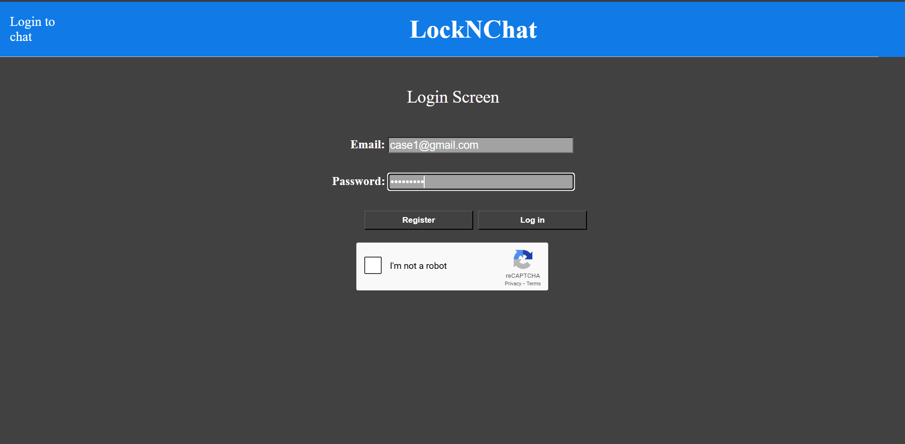
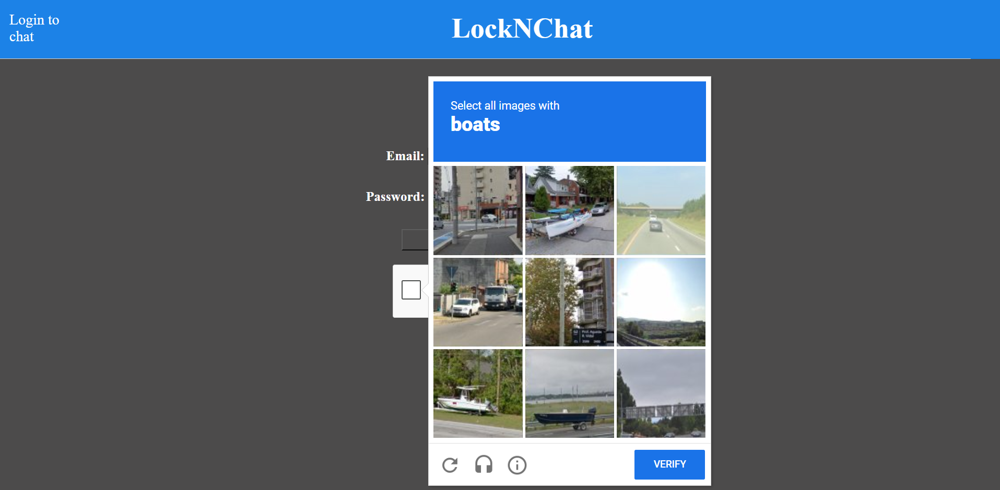
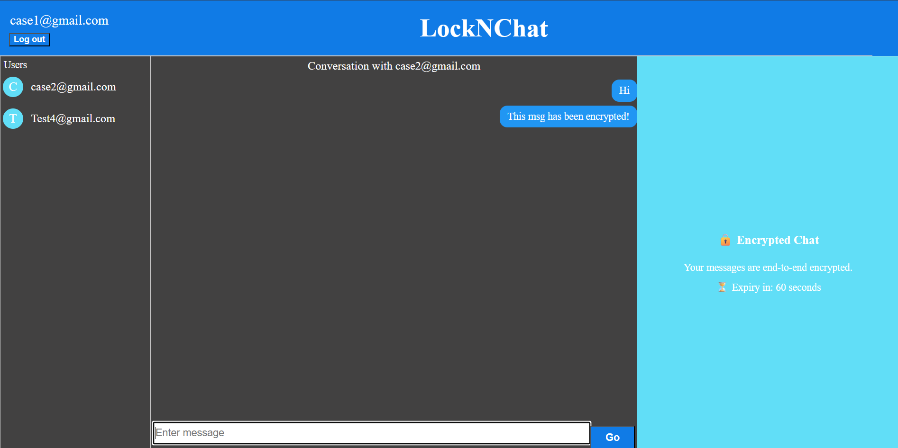

# 🔒 LockNChat

<p align="center">
A real-time, end-to-end encrypted messaging app — built with React & Firebase
</p>

<p align="center">
Private conversations, secured client-side — the server never sees your plaintext.
</p>


## 📘 Overview

LockNChat (codenamed *SecureChat* during development) is a secure messaging web app built around a simple idea:

> Chat applications should not be able to read user messages.

Each message is encrypted on the sender’s device and decrypted only on the recipient’s device. Firebase handles real-time delivery and authentication — but stores only encrypted data.

---

## ✨ Key Features

* 🔐 **End-to-End Encryption**
  Messages are encrypted with AES before leaving the browser and decrypted only on the recipient’s side.

* 🔑 **Diffie-Hellman Key Exchange**
  Each conversation derives a shared secret independently — never transmitted or stored.

* 👤 **Secure Authentication**
  Firebase Authentication with enforced password strength rules.

* 🤖 **Anti-Bot Protection**
  CAPTCHA + login rate limiting to reduce brute-force attempts.

* ⏳ **Message Expiration (Planned)**
  Designed to support self-destructing messages.

* 🎨 **Minimal UI**
  Clean interface with simple routing (`/` for auth, `/chat` for messaging).

---
## 🔐 How Encryption Works

1. Each user generates a private key
2. Diffie-Hellman computes a shared secret (never transmitted)
3. Messages are AES-encrypted using that secret
4. Firestore stores only ciphertext
5. Recipient decrypts locally
---

## 📸 Screenshots

<p align="center">
<p align="center">
  
  
  
  
</p>
</p>


---

## 🛠️ Tech Stack

* **Frontend:** React
* **Backend:** Firebase (Authentication + Firestore)
* **Encryption:** crypto-js (AES) + Diffie-Hellman key exchange
* **Other:** uuid

---

## 🚀 Getting Started

### 1. Clone the repository

```bash
git clone https://github.com/harshithaad/LockNChat.git
cd LockNChat
```

### 2. Install dependencies

```bash
npm install
```

### 3. Configure environment variables

Create a `.env` file (never commit this):

```env
REACT_APP_FIREBASE_API_KEY=your_api_key
REACT_APP_FIREBASE_AUTH_DOMAIN=your_project_id.firebaseapp.com
REACT_APP_FIREBASE_PROJECT_ID=your_project_id
REACT_APP_FIREBASE_STORAGE_BUCKET=your_project_id.appspot.com
REACT_APP_FIREBASE_MESSAGING_SENDER_ID=sender_id
REACT_APP_FIREBASE_APP_ID=app_id
```

⚠️ Keep this file private.

---

### 4. Run the app

```bash
set NODE_OPTIONS=--openssl-legacy-provider
npm start
```

Open http://localhost:3000

---

## 🧭 Usage

* Visit `/` to register or log in

* Password requirements:

  * 8+ characters
  * Uppercase, lowercase, number, special character

* After 2 failed login attempts → 1-minute cooldown

* Complete CAPTCHA verification

* Go to `/chat` to send encrypted messages

---


<p align="center">
Built with ❤️ for private, secure conversations.
</p>
