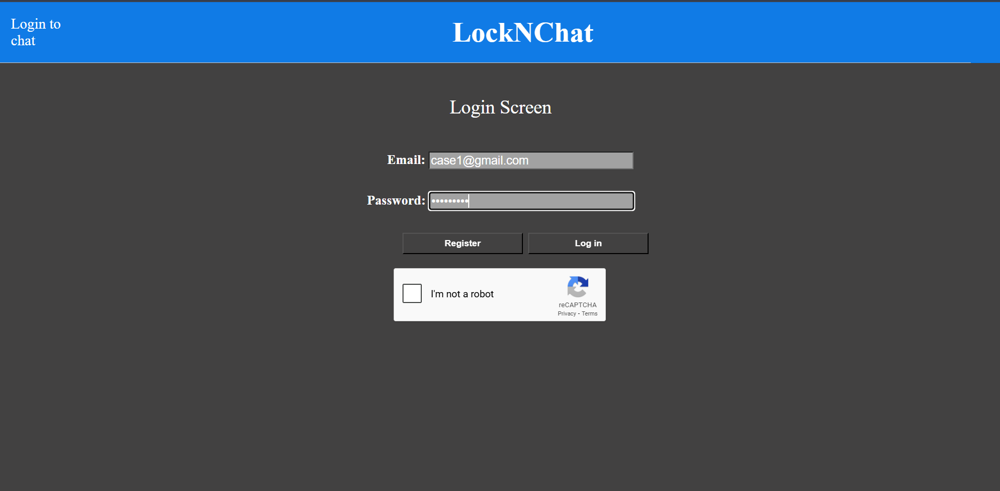
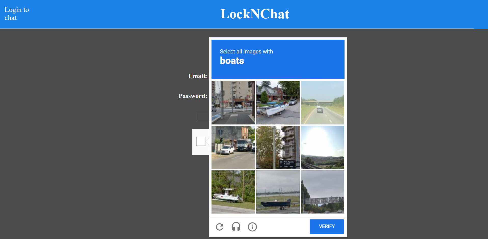
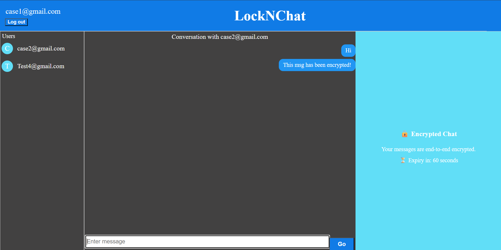

# 🔒 LockNChat

<p align="center">
A real-time, end-to-end encrypted messaging app — built with React & Firebase
</p>

<p align="center">
Private conversations, secured client-side — the server never sees your plaintext.
</p>
> **🚧 v2 in progress:** LockNChat is being rebuilt with a Node.js/Express backend, Socket.io real-time messaging, JWT + bcrypt authentication, and proper end-to-end encryption (Web Crypto API). The original React + Firebase prototype is preserved under the [`v1-firebase`](../../tree/v1-firebase) tag.

## 📘 Overview

LockNChat (codenamed *SecureChat* during development) is a secure messaging web app built around a simple idea:

> Chat applications should not be able to read user messages.

Each message is encrypted on the sender’s device and decrypted only on the recipient’s device. Firebase handles real-time delivery and authentication — but stores only encrypted data.


## 📸 Screenshots

<p align="center">
<p align="center">
  
  
  
  
</p>
</p>


---

## 🚀 Getting Started

### 1. Clone the repository

```bash
git clone https://github.com/harshithaad/LockNChat.git
cd LockNChat
```

---

### 4. Run the app

```bash
set NODE_OPTIONS=--openssl-legacy-provider
npm start
```

Open http://localhost:3000

---

## 🧭 Usage

* Visit `/` to register or log in

* Password requirements:

  * 8+ characters
  * Uppercase, lowercase, number, special character

* After 2 failed login attempts → 1-minute cooldown

* Complete CAPTCHA verification

* Go to `/chat` to send encrypted messages

---


<p align="center">
Built with ❤️ for private, secure conversations.
</p>
