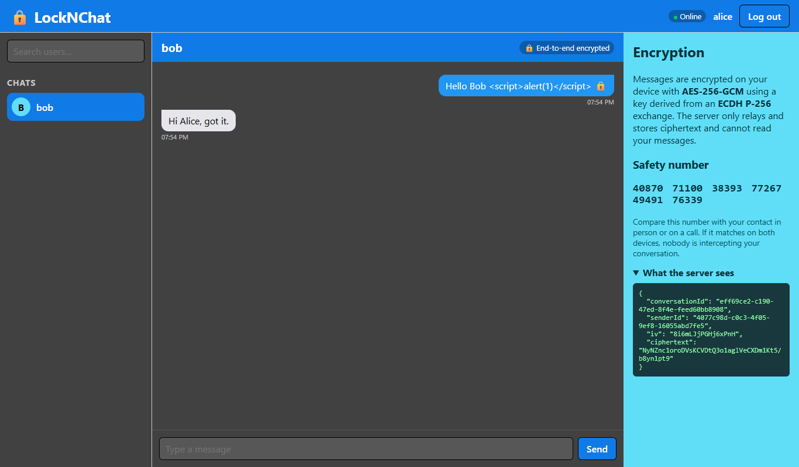
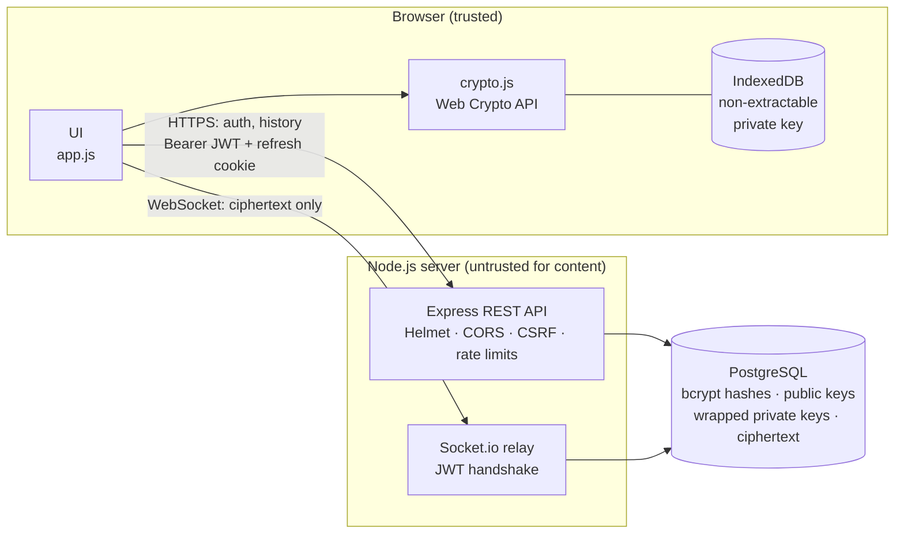
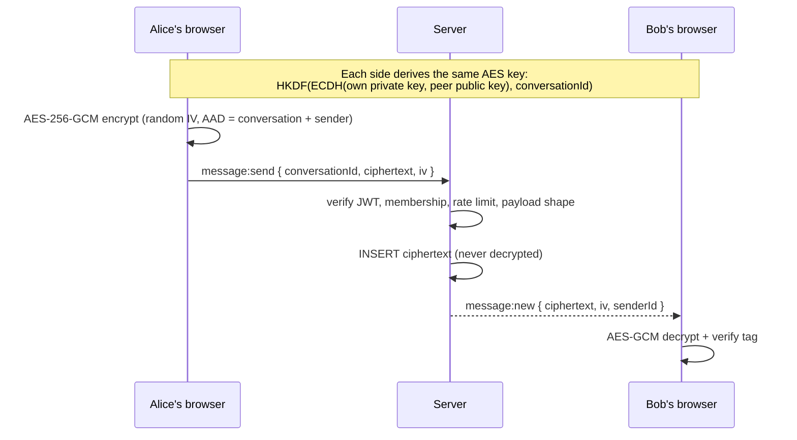
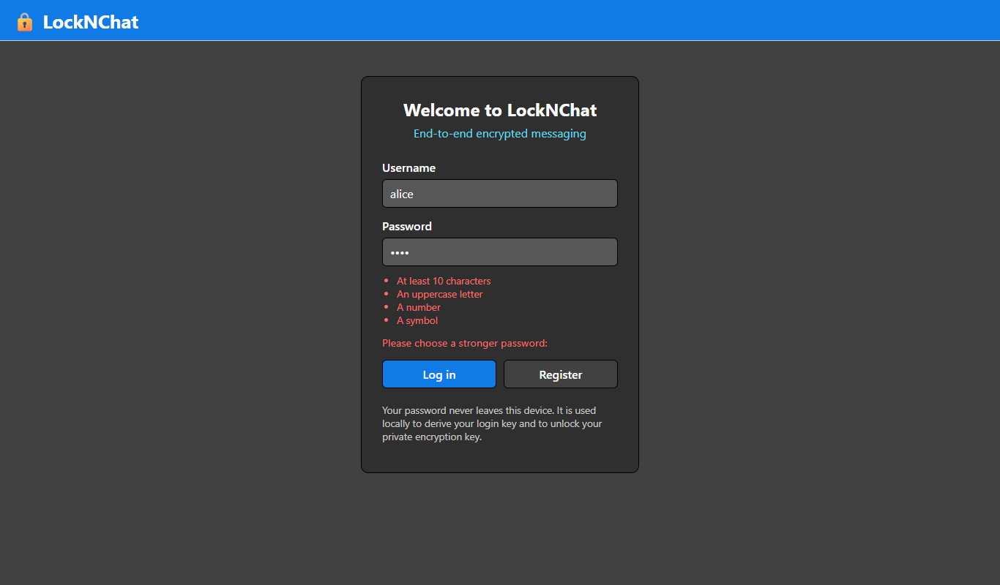
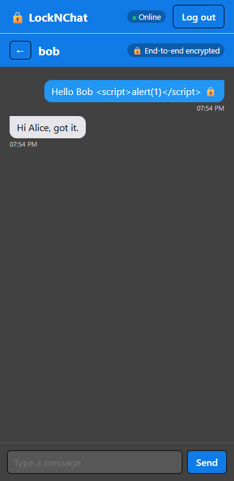

# 🔒 LockNChat

[](https://github.com/harshithaad/LockNChat/actions/workflows/ci.yml)

A real-time, end-to-end encrypted messaging app built with **Node.js, Express, Socket.io and PostgreSQL**.
Messages are encrypted in the browser with the Web Crypto API, so the server only ever relays and stores ciphertext.

<p align="center">
  
</p>

## Features

- **End-to-end encryption**: ECDH P-256 key agreement and AES-256-GCM per message. Private keys never leave the device unencrypted.
- **Real-time messaging** over Socket.io, with message history and multi-tab support.
- **Multi-layer authentication**:
  - the password is stretched on the client (PBKDF2)
  - the server bcrypt-hashes the derived key
  - short-lived JWT access tokens
  - rotating refresh tokens with reuse detection
- **Session replay protection**: every refresh token works once. Replaying a stolen one revokes the whole session.
- **Hardened against the OWASP Top 10**:
  - Helmet.js secure headers with a strict CSP
  - CSRF defenses
  - parameterized SQL
  - schema validation on every input
  - rate limiting and account lockout
- **Key verification**: safety numbers and key-change warnings defend against man-in-the-middle attacks.
- **"What the server sees" panel**: shows the actual ciphertext of each message, live.

## Tech stack

| Layer     | Technology |
|-----------|------------|
| Server    | Node.js 20, Express 5, Socket.io 4 |
| Auth      | jsonwebtoken (HS256), bcrypt, httpOnly cookies |
| Security  | Helmet.js, CORS allowlist, express-rate-limit, zod |
| Database  | PostgreSQL 16 (via Docker), `pg` with parameterized queries |
| Client    | Plain HTML, CSS and JavaScript (ES modules, no build step) |
| Crypto    | Web Crypto API: PBKDF2, HKDF, ECDH P-256, AES-256-GCM |
| Testing   | Jest + Supertest, Socket.io client, Node test runner |

## Architecture


```mermaid
flowchart LR
  subgraph Browser["Browser (trusted)"]
    UI[UI<br/>app.js]
    C[crypto.js<br/>Web Crypto API]
    K[(IndexedDB<br/>non-extractable<br/>private key)]
  end

  subgraph Server["Node.js server (untrusted for content)"]
    E[Express REST API<br/>Helmet · CORS · CSRF · rate limits]
    S[Socket.io relay<br/>JWT handshake]
  end

  DB[(PostgreSQL<br/>bcrypt hashes · public keys<br/>wrapped private keys · ciphertext)]

  UI --> C
  C --- K
  UI -- "HTTPS: auth, history<br/>Bearer JWT + refresh cookie" --> E
  UI -- "WebSocket: ciphertext only" --> S
  E --> DB
  S --> DB
```

### How a message travels


```mermaid
sequenceDiagram
  participant A as Alice's browser
  participant S as Server
  participant B as Bob's browser
  Note over A,B: Each side derives the same AES key:<br/>HKDF(ECDH(own private key, peer public key), conversationId)
  A->>A: AES-256-GCM encrypt (random IV, AAD = conversation + sender)
  A->>S: message:send { conversationId, ciphertext, iv }
  S->>S: verify JWT, membership, rate limit, payload shape
  S->>S: INSERT ciphertext (never decrypted)
  S-->>B: message:new { ciphertext, iv, senderId }
  B->>B: AES-GCM decrypt + verify tag
```

### Authentication flow

1. The browser derives `master = PBKDF2(password, 600k iterations)`, then uses HKDF to split it into:
   - an **auth key**, which is sent to the server
   - a **wrap key**, which stays on the device
2. The server stores `bcrypt(authKey)`. It never receives the password, so it can't derive the wrap key.
3. A successful login returns:
   - a **15-minute JWT access token**, held in memory only
   - a **refresh token** in an `httpOnly; Secure; SameSite=Strict` cookie
   - the user's **wrapped private key**, which the browser decrypts locally
4. Each refresh **rotates** the refresh token. If an already-used token appears again, the server revokes every token in that session.

See [SECURITY.md](SECURITY.md) for the full threat model and known limitations.

## Getting started

**Prerequisites:** Node.js 20+ and Docker Desktop.

```bash
git clone https://github.com/harshithaad/LockNChat.git
cd LockNChat

# 1. Install server dependencies
npm run setup

# 2. Configure the server
cp server/.env.example server/.env        # Windows cmd: copy server\.env.example server\.env
#    then set JWT_SECRET in server/.env, e.g. with:
#    node -e "console.log(require('crypto').randomBytes(48).toString('base64url'))"

# 3. Start PostgreSQL (port 5433 on localhost)
npm run db

# 4. Run migrations and start the app
npm start
```

Open http://localhost:3000. To chat with yourself, open a second browser profile or a private window and register a second user.

### Running the tests

```bash
npm run db   # tests use a separate locknchat_test database
npm test
```

The suite covers:

- **Server**: authentication, JWT tampering, refresh-token reuse, CSRF, CORS, lockout and rate limiting, SQL injection payloads, IDOR, WebSocket auth and flood limits.
- **Client**: key derivation, wrapping, encryption, tamper detection and safety numbers.
- **Full flow**: an end-to-end test proving the server stores nothing readable.

## Project structure

```
client/
  public/            static files served by Express
    js/crypto.js     all end-to-end encryption (Web Crypto API)
    js/api.js        HTTP client, in-memory access token, refresh handling
    js/keystore.js   IndexedDB storage for the non-extractable private key
    js/app.js        UI, Socket.io client, message flow
  test/              crypto unit tests + full-flow integration test
server/
  src/
    app.js           Express app and middleware stack
    server.js        HTTP + Socket.io bootstrap
    config.js        validated environment config
    db/              connection pool, migration runner, SQL migrations
    lib/             tokens, cookies, schemas, rate bucket
    middleware/      Helmet/CORS/rate limits, auth, CSRF, validation, errors
    routes/          auth, users, conversations, health
    services/        auth and conversation logic
    socket/          Socket.io authentication and message relay
  test/              Jest + Supertest + Socket.io client tests
docs/
  burp-testing.md    manual security testing guide (Burp Suite)
```

## API overview

| Method | Path | Auth | Purpose |
|--------|------|------|---------|
| POST | `/api/auth/register` | none | Create account, upload public key + wrapped private key |
| POST | `/api/auth/login` | none | Verify credentials, return tokens + wrapped key |
| POST | `/api/auth/refresh` | refresh cookie + CSRF header | Rotate refresh token, issue new access token |
| POST | `/api/auth/logout` | refresh cookie + CSRF header | Revoke the session |
| GET | `/api/users/me` | Bearer | Current user |
| GET | `/api/users/search?q=` | Bearer | Find users by username prefix |
| GET | `/api/users/:id` | Bearer | Public key directory |
| GET | `/api/conversations` | Bearer | List your conversations |
| POST | `/api/conversations` | Bearer | Open (or get) a 1-to-1 conversation |
| GET | `/api/conversations/:id/messages` | Bearer | Encrypted message history (participants only) |
| WS | `message:send` / `message:new` | JWT in handshake | Send and receive ciphertext in real time |

## Security testing

- [SECURITY.md](SECURITY.md): threat model, cryptographic design, OWASP controls and known limitations.
- [docs/burp-testing.md](docs/burp-testing.md): a step-by-step Burp Suite test plan covering:
  - session replay
  - JWT tampering
  - CSRF
  - SQL injection
  - XSS
  - IDOR
  - WebSocket tampering

## Version history

- **v2 (current)**: rebuilt with a Node.js/Express backend, PostgreSQL, Socket.io, JWT + bcrypt authentication and real end-to-end encryption.
- **v1** ([`v1-firebase`](../../tree/v1-firebase)): the original React + Firebase prototype. Reviewing it showed serious design flaws:
  - private keys were stored in the database
  - the Diffie-Hellman exponentiation was incorrect
  - sessions were trusted from `localStorage`

  Those findings motivated the v2 rewrite.

<p align="center">
  
  
</p>
